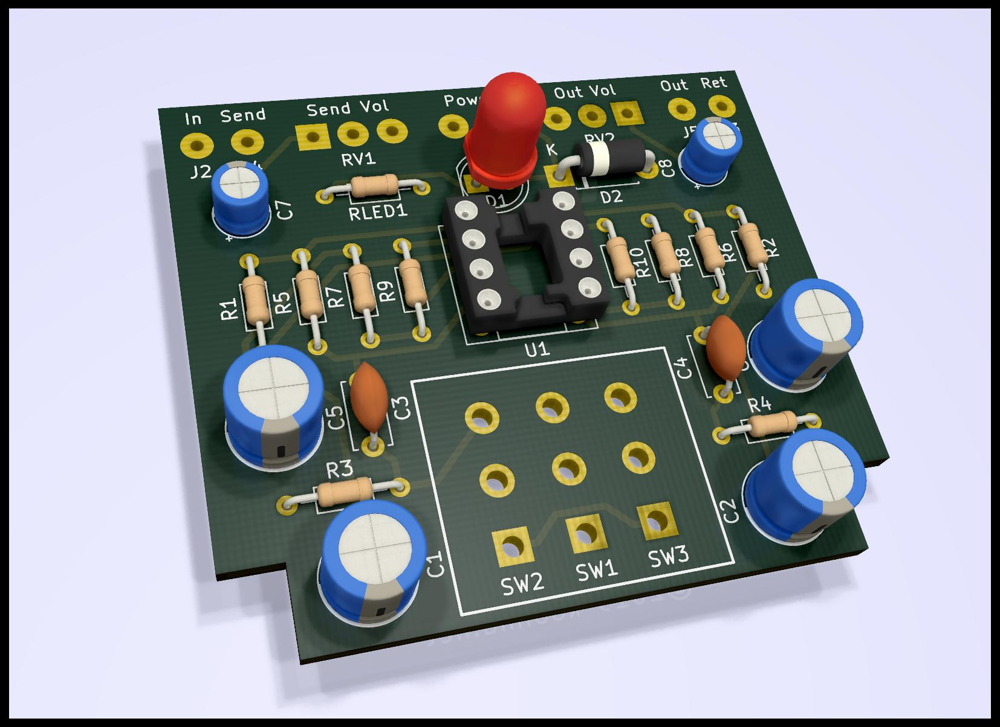

# Bloop2

Boosted loop switcher circuit.

- [Schematic PDF](etc/Bloop2.pdf)
- [Hammond 1590B Drill Template SVG](etc/Bloop2.svg)

## Design notes

- The overall structure uses a constant gain with a volume control at the output.
	- As opposed to a variable gain.
	- This makes attenuation possible with a non-inverting amplifier.
	- This also makes it possible to dial back noise.

- The schematic specifies a TL072, but any standard pin-out dual op amp will do.
	- Op amp selection will not make a significant difference in color, as this circuit remains squarely within the common mode when correctly powered.

- The voltage requirement is entirely determined by the op amp. 
	- Many op amps will want to see V+ between 9V and 15V.
	- I spec the TLE2072 which is within spec at V+ = 18V. 

- The PCB is sized and shaped to fit a Hammond 1590B.
	- Extents are limited to 50mm x 50mm to fit the cheap option at dirtypcbs.com.

- The PCB layout dictates the pin pitch of the stomp switch.
	- The current design specifies an E-Switch FS57003PLT2B2M2QE, which has 5.3mm x 4.8mm pitch.

- D2 can be any Schottky larger than V+.
	- They all cost the same.

- RLED1 is specified at V+ = 9V, Vf = 2.2V, If = 20mA.
	- (9.0 - 2.2) / 0.020 = 340Ω.
	- Watch out for over-current on your LED with higher V+.
		- Or don't. It's probably fine at 40mA.

- R1 = R2.
	- They form a voltage divider giving the reference voltage.

- C1 and C2 values are cargo-culted from common designs.
	- They match C5 and C6 by coincidence. I guess this eases sourcing.

- The two channels are identical.
	- Component value selections should be consistent between the two.
	- Though it's rational for the maximum Output gain to be lower than the maximum Send gain, if desired, since the loop is usually hotter than the line and Send usually amplifies while Output attenuates.

- R3 and C3 form a high-pass filter on the input.
	- The 3dB point is 1 / (2 pi R C) = 1.6Hz.

- R3 = R5.
	- As a rule, R5 >> R1.
	- It's not strictly necessary that R3 = R5, except that both applications call for large R, and I appreciate the symmetry whereby two distinct potentials are established on either side of C3.

- Gain is 1 + R9 / R7.
	- With R9 = 22K and R7 = 2.2K, voltage gain is 11.
	- Keep these low to eliminate noise. Near-zero current flows here.

- C5 is needed to eliminate DC gain, but incurs a high-pass filter on the feedback.
	- The value is selected to impedance match R7 at a frequency well below the audio band.
	- The 3db point is 1 / (2 pi R C) = 1.5Hz.
	- The motivation to keep R7 and R9 small leads to large C5 [AoE 4.2.2.A].

- C7 and RV1 form a high-pass filter on the output.
	- The 3dB point is 1 / (2 pi R C) = 1.6Hz.
	- Larger RV1 permits a smaller C7 if desired.
	- This need not be polar, but capacitor type seems to a have a significant impact on color here.

- Pin 3 of RV1 and RV2 must be grounded, but it's not strictly necessary to ground at the given PCB pad.