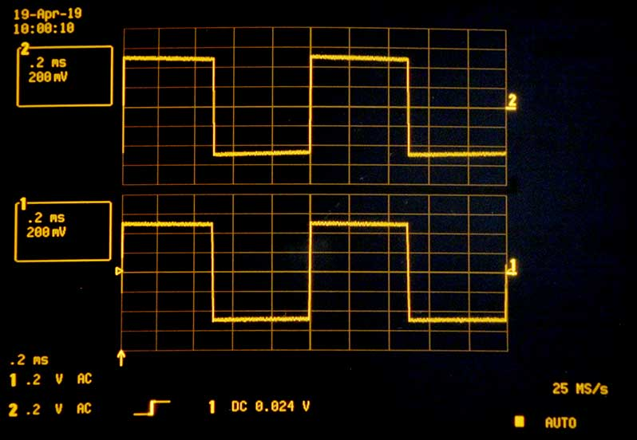
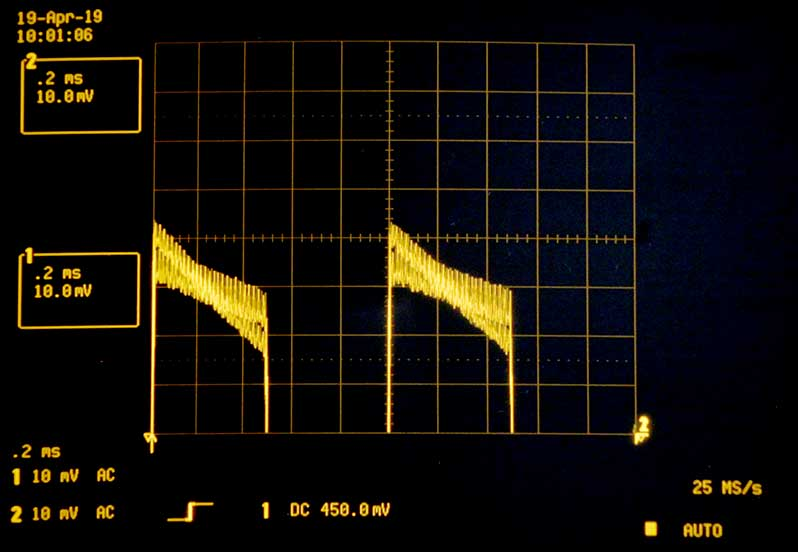
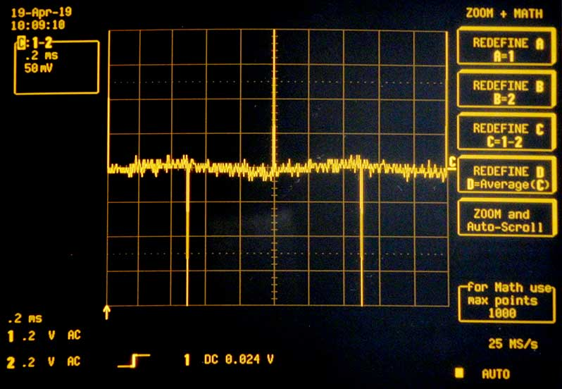
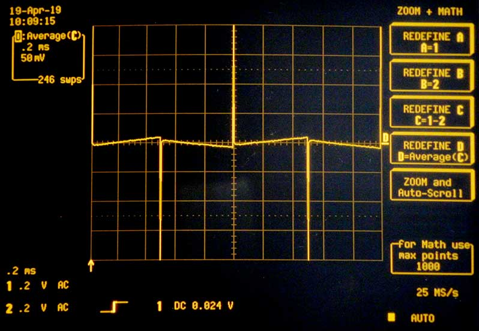
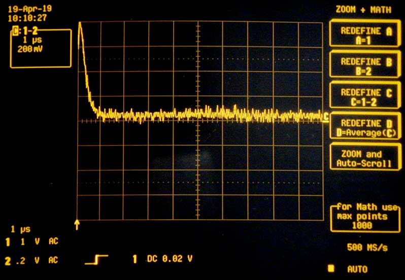
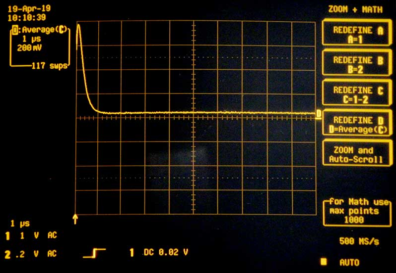

# Bloop2 — Dual Op-Amp Boosted Loop Switcher

Bloop2 is an effects loop switcher. It has Instrument Input and Amplifier Output jacks, plus effects loop Send and Return jacks with a single stomp button to switch that loop in or out. But because it's often desirable to run the effects loop louder than the instrument signal, Bloop2 provides volume controls at both the Send and Return, with a maximum gain of around 10. When switched off, the circuit is fully bypassed.

- [Schematic PNG](etc/Bloop2-Schematic.png)
- [Schematic PDF](etc/Bloop2-Schematic.pdf)
- [Hammond 1590B Drill Template SVG](etc/Bloop2-Drill-Template.svg)
- [PCB Prerendering](etc/Bloop2-Render.jpeg)
- [Gerber Files](etc/gerber)

Finished photos:

- [Enclosure](etc/Bloop2-Enclosure.jpeg)
- [Guts](etc/Bloop2-Guts.jpeg)

## Design notes

- The overall structure uses a constant gain with a volume control at the output.
	- As opposed to a variable gain.
	- This makes attenuation possible with a non-inverting amplifier.
	- This also makes it possible to dial back noise.

- The schematic specifies a TL072, but any standard pin-out dual op amp will do.
	- Op amp selection will not make a significant difference in color, as this circuit remains squarely within the common mode when correctly powered.

- The voltage requirement is entirely determined by the op amp. 
	- I use a TLE2072 which is within spec at either V+ = 9V or 18V. 

- The PCB is sized and shaped to fit a Hammond 1590B.
	- The 1590B is 56mm wide overall, but only 44mm wide at the ends. Thus the cutouts.
	- The PCB is limited to 50mm x 50mm to fit the cheap option at [DirtyPCBs].

- The PCB layout dictates the pin pitch of the stomp switch.
	- The current design specifies an E-Switch FS57003PLT2B2M2QE, which has 5.3mm x 4.8mm pitch.

- D2 can be any Schottky larger than V+.
	- They tend to cost the same regardless of voltage.

- The LED is specified at V+ = 9V, Vf = 2.2V, If = 20mA.
	- RLED1 = (9.0 - 2.2) / 0.020 = 340Ω.
	- Watch out for over-current on your LED with higher V+.
		- Or don't. It's probably fine at 40mA.

- R1 = R2.
	- They form a voltage divider giving the reference voltage.

- C1 and C2 values are cargo-culted to 47uF from common designs.
	- These values are pretty arbitrary.
		- Though the circuit will take a moment to start up if too small.
	- They match C5 and C6 by coincidence. I guess this eases sourcing.

- The two channels are identical.
	- Component value selections should be consistent between the two.
	- Though it's rational for the maximum Output gain to be lower than the maximum Send gain, if desired, since the loop is usually hotter than the line and Send usually amplifies while Output attenuates.

- R3 and C3 form a high-pass filter on the input.
	- The 3dB point is 1 / (2π R3 C3) = 1.6Hz.

- R3 = R5.
	- As a rule, R5 >> R1.
	- It's not strictly necessary that R3 = R5, except that both applications call for large R, and I appreciate the symmetry whereby two distinct potentials are established on either side of C3.

- Gain is 1 + R9 / R7.
	- With R9 = 22K and R7 = 2.2K, voltage gain is 11.
	- Keep R7 and R9 low to eliminate noise. Effectively zero current flows here.

- C5 is needed to eliminate DC gain, but incurs a high-pass filter on the feedback.
	- The value is selected to impedance match R7 at a frequency well below the audio band.
	- The 3db point is 1 / (2π R7 C5) = 1.5Hz.
	- The motivation to keep R7 and R9 small leads to large C5 ([AoE] 4.2.2.A).

- C7 and RV1 form a high-pass filter on the output.
	- The 3dB point is 1 / (2π RV1 C7) = 1.6Hz.
	- Larger RV1 permits a smaller C7 if desired.
	- C7 need not be polar, but capacitor type seems to a have a significant impact on color here.

- Pin 3 of RV1 and RV2 must be grounded, but it's not strictly necessary to ground at the given PCB pad.

- The circuit and signal grounds are completely separate, as designed. You'll probably want to tie them together. This is most easily done off-board, by wiring the negative terminal of the power jack to the sleeve terminal of one of the audio jacks.

## Analysis

To measure the circuit's effect on the input, here are a few screenshots from my scope. These show one channel of the device acting on a 1Hz 1Vpp square wave. Channel 1 displays the Instrument Input, at the bottom, and channel 2 displays the Send output, at the top. The volume is tuned to unity. The two traces appear identical.

To see a difference, zoom in on the waveform.

To analyze this, compute the difference between the input and output, similarly zoomed. We see noise on the scale of 10mV peak-to-peak, centered on zero. Spikes appear at the transitions indicating a tiny phase shift in the output. The difference, for the most part, remains near zero.

To quantify this effect, compute the running average of the difference to eliminate noise. This demonstrates a minor deviation from square of about 5mV, or 0.5% of the amplitude of the input, well within the noise.

The spike in the difference indicates a tiny phase shift in the output. Reducing the time interval lets us quantify it.

Smoothing shows this delay to be around 1 microsecond.

Performance of the other channel is effectively identical.

[AoE]: https://artofelectronics.net
[DirtyPCBs]: https://dirtypcbs.com